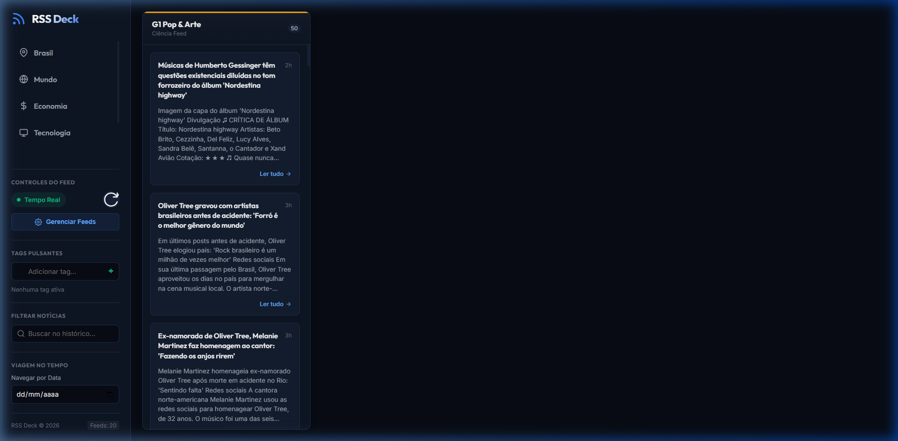
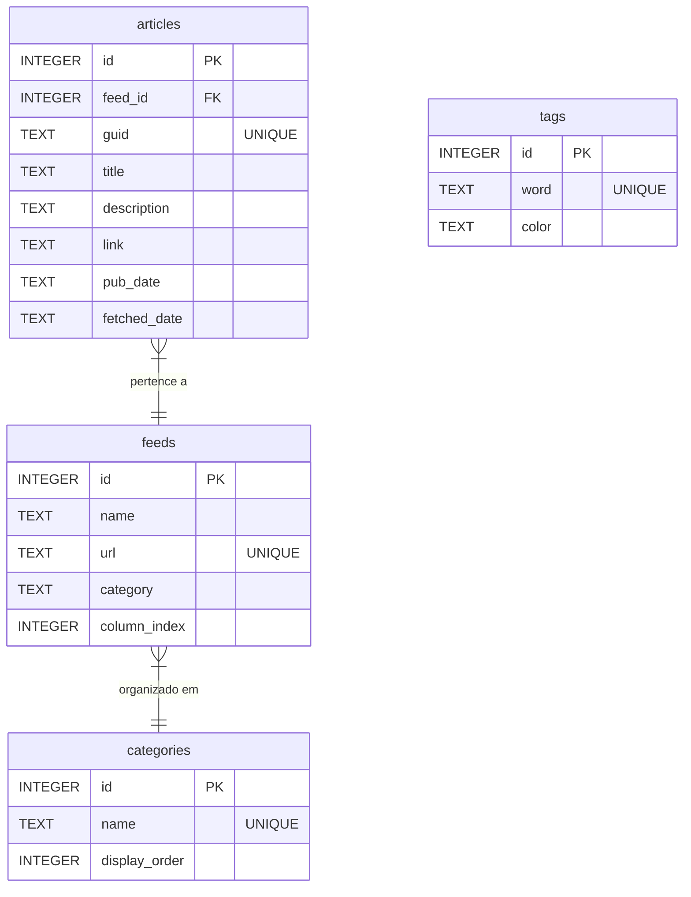

# 📡 RSS Deck — Dashboard de Feeds em Tempo Real

<p align="center">
  
  
  
  
</p>

<p align="center">
  
</p>

O **RSS Deck** é uma dashboard de notícias em tempo real inspirada no design clássico do *TweetDeck*. Ele permite acompanhar múltiplos canais de notícias (feeds RSS/Atom) de forma síncrona através de colunas verticais roláveis, organizadas em abas de categorias dinâmicas. O aplicativo conta com cache local SQLite persistente para busca histórica de notícias, alertas visuais neon e reordenação de colunas por arrastar e soltar (drag-and-drop).

---

## ✨ Principais Funcionalidades

- **🗂️ Categorias Dinâmicas e Customizadas**: Alterne facilmente entre abas organizadas (Ex: *Brasil, Mundo, Economia, Tecnologia, Guerras*) e crie novas categorias direto na interface.
- **🛠️ Gerenciador de Feeds RSS (CRUD)**: Cadastre novos feeds RSS em segundos, edite nomes/URLs, apague canais antigos ou alterne-os de categorias. O sistema executa uma varredura (*crawl*) automática e instantânea de novos feeds cadastrados.
- **🔄 Reordenação por Arrastar e Soltar (Drag & Drop)**: Organize visualmente suas colunas de feeds em tempo real arrastando-as de um lado para o outro. A nova ordem é salva e persistida automaticamente no banco de dados.
- **🚨 Tag Manager (Alertas Pulsantes)**: Cadastre palavras-chave e tags de monitoramento. Quando um termo cadastrado surge em uma notícia, o título ganha destaque neon vermelho pulsante e o card inteiro emite um brilho pulsante.
- **⏳ Viagem no Tempo (Time-Travel)**: Filtre o feed de notícias por data (dia específico no histórico) e faça buscas por palavra-chave instantâneas.
- **🧹 Filtros e Higienização Inteligente (UOL & Gerais)**: Impede a inserção de lixo, links duplicados ou cartões vazios (como placeholders comuns de notícias vazias do UOL). Garante que todos os cards tenham títulos e resumos reais.
- **⚡ Animações e Micro-Interações Premium**:
  - Efeito hover magnético e inclinável nos cards com reflexo de brilho varrendo a superfície (*shine sweep*).
  - Animação futurista de scan laser azul cobrindo a tela durante as atualizações manuais do feed.
  - Carregamento de colunas com efeito cascata (*staggered animations*).

---

## 🛠️ Stack Tecnológica

- **Backend**: Python 3, Flask, SQLite3, `feedparser`, `requests`, `urllib3`
- **Frontend**: HTML5 Semântico, CSS3 (Efeitos Glassmorphism, CSS Variables, Keyframes Avançados), Vanilla JavaScript (Drag and Drop nativo, Fetch API, DOM mutations)

---

## 📁 Estrutura do Banco de Dados

O banco SQLite local (`rss_deck.db`) utiliza uma estrutura relacional normalizada com integridade de chave estrangeira (`ON DELETE CASCADE`):



---

## 🚀 Instalação e Execução

### Opção 1: Instalador Gráfico (Windows - Recomendado)
O projeto inclui um instalador desktop completo (`installer.py`) feito com `tkinter` em tema escuro personalizado.

1. Execute o instalador:
   ```bash
   python installer.py
   ```
2. O instalador exibirá os termos de licença **GPLv3**. Marque a caixa de aceite e selecione a pasta de instalação (padrão: `AppData/Local/RSSDeck`).
3. O instalador irá:
   - Copiar os arquivos necessários para a pasta escolhida.
   - Instalar dependências silenciosamente via `pip`.
   - Criar um atalho na sua Área de Trabalho com suporte a execução silenciosa em segundo plano (`pythonw.exe app.py`).
4. Ao concluir, marque "Iniciar o RSS Deck agora" ou clique no atalho criado. O programa abrirá o navegador local e rodará silenciosamente na **Bandeja do Sistema (System Tray)**.

### Opção 2: Execução Manual
Se preferir rodar manualmente sem instalar:

1. Instale as dependências listadas no `requirements.txt`:
   ```bash
   pip install -r requirements.txt
   ```
2. Inicialize o servidor Flask e o ícone de bandeja:
   ```bash
   python app.py
   ```
   *Nota: O script abrirá a dashboard no navegador padrão (`http://127.0.0.1:5000/`) e rodará na System Tray.*

---

## ⚙️ Bandeja do Sistema & Instância Única

- **Modo Tray**: O aplicativo roda em segundo plano e exibe um ícone personalizado com anéis concêntricos na bandeja do sistema do Windows.
- **Menu da Tray**: Clique com o botão direito no ícone para acessar:
  - **Abrir RSS Deck**: Abre a dashboard no seu navegador padrão.
  - **Sair**: Fecha completamente o servidor de feeds e remove o ícone da bandeja.
- **Instância Única (Single Instance Check)**: Se você clicar no atalho da área de trabalho enquanto o servidor já estiver ativo em segundo plano, o programa detectará o serviço na porta 5000, apenas abrirá a página no seu navegador e encerrará o processo redundante para não duplicar consumo de memória.

---

## 🧪 Rodando os Testes

Para validar a suíte integrada de testes unitários e rotas da API, execute:
```bash
pytest
```
A suíte valida:
- Integridade do esquema SQLite e sementes iniciais.
- Standardização de data/hora (RFC 822/ISO 8601).
- Rotas REST de feeds (criação, edição inline, exclusão, reordenação).
- Regras de filtros gerais e purga de placeholders legados.

---

Desenvolvido com carinho por **Jairo Ivo** e design premium. 📡
