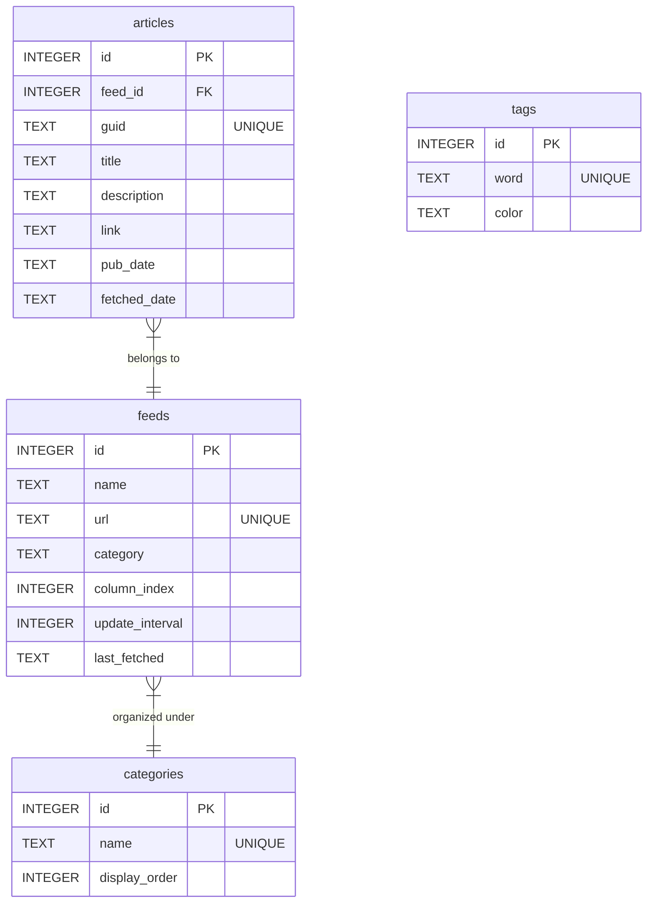

# RSS Deck — Real-Time RSS/Atom Feed Dashboard

<p align="center">
  
  
  
  
</p>

<p align="center">
  
</p>

---

## Language / Idioma
- [English](#english)
- [Português](#português)

---

# English

**RSS Deck** is a professional real-time news dashboard inspired by the classic multi-column layout of *TweetDeck*. It allows users to aggregate and monitor multiple RSS/Atom feeds concurrently through vertical scrollable columns organized into dynamic category tabs. The application is built using a local persistent SQLite database in Write-Ahead Log (WAL) mode, supporting historical news searches, custom tag highlights, and native Windows System Tray background execution.

## Key Features

- **Dynamic Category Tabs**: Easily switch between standard categories (*e.g., Brazil, World, Economy, Technology, Conflict*) or create custom ones directly from the UI.
- **Feed Manager (CRUD)**: Register, edit, or delete RSS feeds. Bounded dynamically to category tabs with instant automatic crawler processing.
- **Custom Update Intervals**: Configure polling intervals individually per feed. The system automatically calculates a default baseline interval based on the historical publication frequency of each feed.
- **Drag & Drop Reordering**: Reorganize feed columns visually using native drag-and-drop. The layout order is automatically saved and persistent in the database.
- **Header Metadata & Tag Badges**: Shows average publication intervals and polling configurations. Display circular colored reference counters matching active tag keyword alerts.
- **Tag Manager & Pulse Alerts**: Set keywords with custom colors. When a matched term appears in an article title, it displays a neon keyword badge and triggers a subtle glow warning in the card.
- **Targeted Column Refresh**: Perform updates on a single feed column with a futuristic scanner animation overlay without triggering a global refresh.
- **Update Detector**: Automatically queries the GitHub Releases API and displays a top notification banner if a newer desktop version is available.
- **Time-Travel (Historical Archives)**: Filter articles by a specific publication date and perform instant text searches across archives.
- **Clean Article Purging**: Sanitizes descriptions (stripping HTML tags) and filters placeholder empty cards (such as empty UOL placeholders) to ensure premium visual consistency.
- **Optimized UI Animations**: Uses lightweight CSS opacity transformations for alerts and transitions to minimize browser CPU/GPU utilization.

---

# Português

O **RSS Deck** é um dashboard profissional de notícias em tempo real inspirado no layout clássico de múltiplas colunas do *TweetDeck*. Ele permite agregar e monitorar múltiplos feeds RSS/Atom simultaneamente através de colunas verticais organizadas em abas de categorias dinâmicas. O aplicativo possui persistência local com banco SQLite rodando no modo Write-Ahead Log (WAL), suportando busca histórica de notícias, destaque de palavras-chave com tags coloridas e execução nativa em segundo plano na bandeja do sistema (System Tray) do Windows.

## Principais Funcionalidades

- **Abas de Categorias Dinâmicas**: Alterne facilmente entre abas organizadas (*ex: Brasil, Mundo, Economia, Tecnologia, Guerras*) ou crie novas categorias diretamente pela interface.
- **Gerenciador de Feeds (CRUD)**: Cadastre, edite ou exclua canais RSS. Integrado com as abas de categorias e com varredura automática imediata após o cadastro.
- **Intervalos de Atualização Customizados**: Configure intervalos de checagem individuais por feed. O sistema autocalcula um tempo padrão com base na média real de publicação de notícias do canal.
- **Reordenação por Arrastar e Soltar (Drag & Drop)**: Reorganize as colunas arrastando-as lateralmente. A ordenação visual é persistida de forma automática no banco de dados.
- **Metadados e Badges de Tags**: Visualize a média de publicação e tempo de polling no topo das colunas. Badges coloridos circulares informam quantas notícias daquela coluna contêm termos de suas tags ativas.
- **Alertas de Tags Pulsantes**: Cadastre palavras-chave e atribua cores. Artigos correspondentes recebem destaque neon no título e um contorno brilhante sutil.
- **Atualização Direcionada por Coluna**: Atualize feeds específicos de forma independente com uma animação futurista de varredura laser na coluna correspondente.
- **Detector de Novas Releases**: Monitora lançamentos no repositório do GitHub e exibe um banner de aviso se houver atualizações disponíveis para download.
- **Viagem no Tempo (Histórico)**: Filtre artigos por um dia específico e realize buscas por termos e palavras-chave.
- **Sanitização Inteligente de Notícias**: Remove tags HTML de descrições e bloqueia placeholders vazios ou notícias de lixo (como links em branco comuns do UOL).
- **Consumo de Recursos Otimizado**: Utiliza animações de opacidade leves para evitar repaints sucessivos no navegador, minimizando o uso de CPU/GPU.

---

## Tech Stack / Tecnologias
- **Backend**: Python 3.10+, Flask, SQLite3 (WAL mode), `feedparser`, `requests`, `pystray`, `Pillow`
- **Frontend**: Semantic HTML5, Vanilla CSS3 (Glassmorphism, CSS variables, keyframe animations), Vanilla JavaScript (Native Drag and Drop, Fetch API, DOM manipulation)

---

## Database Schema / Estrutura do Banco
The SQLite database (`rss_deck.db`) implements a relational model with foreign key constraints (`ON DELETE CASCADE`):



---

## Installation & Running / Instalação e Execução

### Option 1: Desktop Graphical Installer (Windows - Recommended) / Opção 1: Instalador Gráfico (Recomendado)
The installer script packages all dependencies, sets up local directories, and configures the startup shortcut.

1. Execute the installer:
   ```bash
   python installer.py
   ```
2. Read and accept the software license (**GPLv3**) and select the installation directory (Default: `AppData/Local/RSSDeck`).
3. The installer will:
   - Create local destination folders.
   - Install required dependencies silently via `pip`.
   - Setup a desktop shortcut linking to `pythonw.exe app.py` for silent background execution.
4. Launch the application from the desktop shortcut. It runs in the **System Tray** and opens the browser interface.

---

### Option 2: Manual Run / Opção 2: Execução Manual
1. Install dependencies from `requirements.txt`:
   ```bash
   pip install -r requirements.txt
   ```
2. Run the server and system tray icon:
   ```bash
   python app.py
   ```
   *Note: This starts the local server at `http://127.0.0.1:5000/` and launches the tray interface.*

---

## System Tray & Single Instance / Bandeja do Sistema e Instância Única

- **Tray Control**: The backend runs in the background. Right-click the tray icon to access:
  - **Open RSS Deck**: Launches the dashboard in the default browser.
  - **Exit**: Terminates the Flask server and background pollers.
- **Single Instance Guard**: Clicking the desktop shortcut while the backend is already running will not spawn duplicate processes. The program will detect the active port, open the dashboard in the browser, and terminate the redundant launcher immediately.

---

## Running Tests / Executando os Testes

To run the automated suite of unit and integration tests:
```bash
pytest test_app.py
```
The test suite validates:
- SQLite schema structure and cascade deletions.
- Publish date standardization (RFC 822/ISO 8601).
- REST API CRUD and column reordering handlers.
- Cleaning rules for article titles/descriptions and empty placeholder exclusion.
